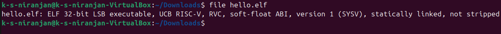

# Hello, RISC-V

A simple "Hello, World!" program compiled for RISC-V and executed using QEMU.

---

## 📄 Source Code

### `hello.c`

```c
#include <stdio.h>

int main() {
    printf("Hello, RISC-V!\n");
    return 0;
}
```

### `build.sh`

```bash
#!/bin/bash
riscv64-unknown-elf-gcc -o hello hello.c -static
```

Make it executable:

```bash
chmod +x build.sh
```

---

## 🛠 Requirements

- `riscv64-unknown-elf-gcc` or `riscv32-unknown-elf-gcc`
- `qemu-riscv64` or `qemu-riscv32`

---

## ⚙ Step 1: Build (for 64-bit target)

```bash
./build.sh
```

This compiles `hello.c` into a statically linked RISC-V ELF binary named `hello`.

---

## ▶️ Step 2: Run (for 64-bit target)

```bash
qemu-riscv64 hello
```

Expected output:

```
Hello, RISC-V!
```

---

## 🧩 Optional: Install Tools (Ubuntu/Debian)

### Install RISC-V GCC Toolchain

64-bit:

```bash
sudo apt install gcc-riscv64-unknown-elf
```

32-bit:

```bash
sudo apt install gcc-riscv32-unknown-elf
```

### Install QEMU RISC-V Emulator

```bash
sudo apt install qemu-user qemu-user-static
```

---

## ⚙ Step 2 (Alternate): Compilation for 32-bit RISC-V Target

If you're targeting **32-bit RISC-V (rv32imc)**, compile with:

```bash
riscv32-unknown-elf-gcc -march=rv32imc -mabi=ilp32 -o hello.elf hello.c
```

### Breakdown of Flags:

- `riscv32-unknown-elf-gcc`: This is the RISC-V 32-bit cross-compiler.
- `-march=rv32imc`: Specifies the target microarchitecture (RV32I + M + C extensions).
- `-mabi=ilp32`: Sets the Application Binary Interface (ABI).
- `-o hello.elf`: Output ELF file.
- `hello.c`: Source code file.

---

## 🧐 Step 3: Verifying the Output

Use the `file` utility to inspect the generated ELF file:

```bash
file hello.elf
```

Expected output:

```
hello.elf: ELF 32-bit LSB executable, UCB RISC-V, ...
```

---

## ▶️ Step 4: Run (for 32-bit ELF)

```bash
qemu-riscv32 hello.elf
```

Expected output:

```
Hello, RISC-V!
```

---
## 💡 Notes
- Use `riscv64-unknown-elf-gcc` and `qemu-riscv64` for 64-bit programs.
- Use `riscv32-unknown-elf-gcc` and `qemu-riscv32` for 32-bit programs.
- For full OS emulation, use `qemu-system-riscv64` or `qemu-system-riscv32` with a kernel and rootfs.

---


