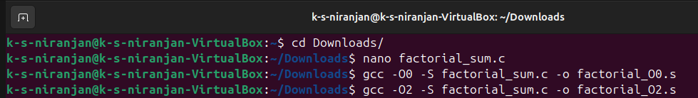
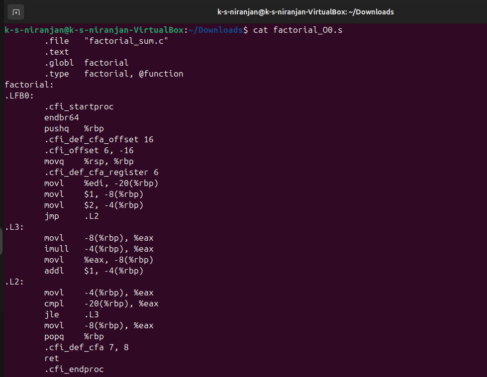
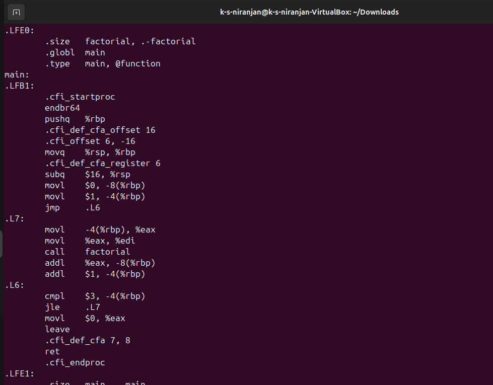
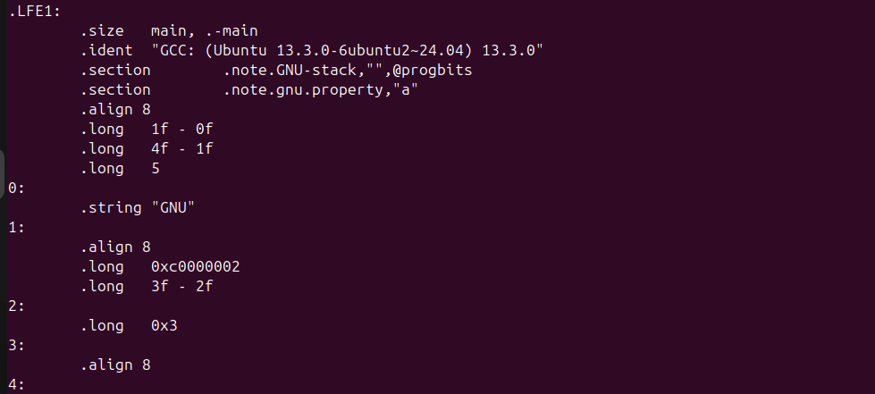
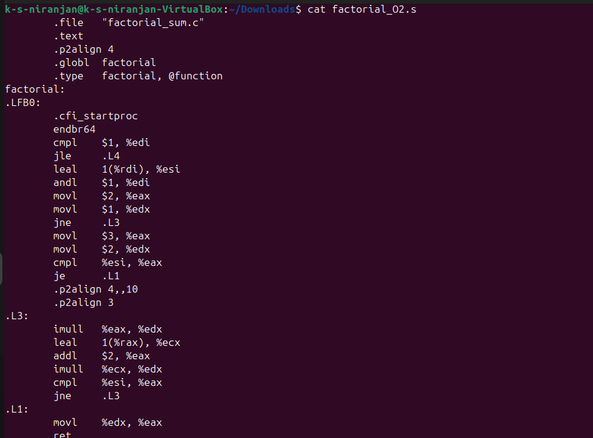
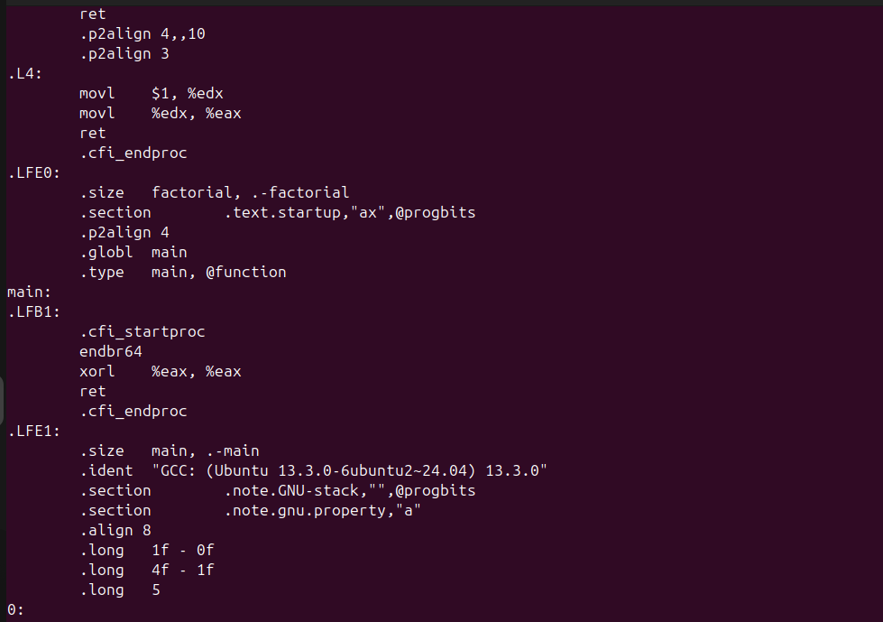
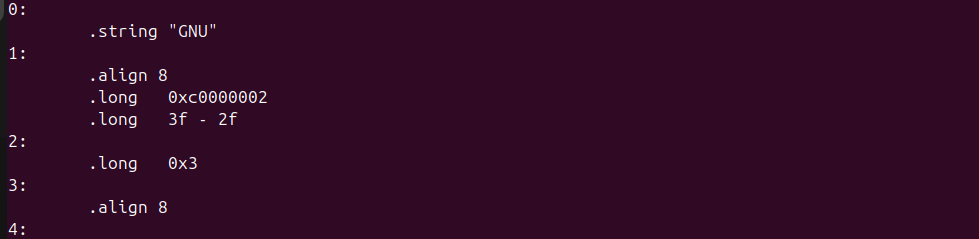

# Exploring GCC Optimisation (Part 2)

## Task
**“Compile the same file with `-O0` vs `-O2`. What differences appear in the assembly and why?”**

---

## Source Code

```c
// factorial_sum.c
int factorial(int n) {
    int result = 1;
    for (int i = 2; i <= n; i++) {
        result *= i;
    }
    return result;
}

int main() {
    int total = 0;
    for (int i = 1; i <= 3; i++) {
        total += factorial(i);
    }
    return 0;
}
```

---

## Method

1. Compile without optimization (`-O0`):
   ```bash
   gcc -O0 -S factorial_sum.c -o factorial_O0.s
   ```

2. Compile with optimization (`-O2`):
   ```bash
   gcc -O2 -S factorial_sum.c -o factorial_O2.s
   ```

3. Compare the `.s` files side-by-side.

---

## Assembly Comparison

### 🔴 `-O0` — No Optimization (Partial Output)

```asm
factorial:
    pushq   %rbp
    movq    %rsp, %rbp
    subq    $16, %rsp
    movl    %edi, -4(%rbp)
    movl    $1, -8(%rbp)
    movl    $2, -12(%rbp)
.L2:
    cmpl    -4(%rbp), -12(%rbp)
    jg      .L3
    movl    -8(%rbp), %eax
    imull   -12(%rbp), %eax
    movl    %eax, -8(%rbp)
    addl    $1, -12(%rbp)
    jmp     .L2
.L3:
    movl    -8(%rbp), %eax
    leave
    ret

main:
    pushq   %rbp
    movq    %rsp, %rbp
    subq    $16, %rsp
    movl    $0, -4(%rbp)
    movl    $1, -8(%rbp)
.L5:
    cmpl    $3, -8(%rbp)
    jg      .L6
    movl    -8(%rbp), %eax
    movl    %eax, %edi
    call    factorial
    movl    -4(%rbp), %edx
    addl    %eax, %edx
    movl    %edx, -4(%rbp)
    addl    $1, -8(%rbp)
    jmp     .L5
.L6:
    movl    $0, %eax
    leave
    ret
```



---

### 🟢 `-O2` — Optimized (Partial Output)

```asm
factorial:
    movl    $1, %eax
    cmpl    $1, %edi
    jle     .L9
    movl    $2, %ecx
.L8:
    imull   %ecx, %eax
    addl    $1, %ecx
    cmpl    %edi, %ecx
    jle     .L8
.L9:
    ret

main:
    movl    $0, %ebx
    movl    $1, %ecx
.L13:
    movl    %ecx, %edi
    call    factorial
    addl    %eax, %ebx
    addl    $1, %ecx
    cmpl    $3, %ecx
    jle     .L13
    xorl    %eax, %eax
    ret
```



---

## Explanation of Optimizations

### ✅ 1. Dead-Code Elimination
- At `-O2`, unused variables like `result` and loop counters are replaced with **direct register use**.
- The stack is barely used — only registers.

### ✅ 2. Loop Optimization
- GCC **tightens loops** by using fewer instructions and smarter comparisons.
- No extra memory access for loop variables.

### ✅ 3. Register Allocation
- At `-O0`, all variables go on stack (`-4(%rbp)`, etc).
- At `-O2`, variables use registers like `%eax`, `%ebx`, `%ecx`.

### ✅ 4. Function Call Optimization
- Function prologues/epilogues (`pushq %rbp`, `movq %rsp, %rbp`, `leave`) are **minimized** or removed.
- Function calls (`call factorial`) are tighter — no redundant memory loads.

### ⚠️ 5. No Inlining (yet)
- Function `factorial()` is still **not inlined** — possibly because it's called multiple times or due to `-fno-inline-small-functions`.

You can try adding `-finline-functions` for aggressive inlining.

---

## Conclusion

Using `-O2` results in:
- Faster execution.
- Fewer memory accesses.
- Fewer instructions.
- More compact assembly.
- Clean loop structure with registers.

Optimizations lead to **better performance**, but debugging becomes more difficult due to removal of source-level constructs.
