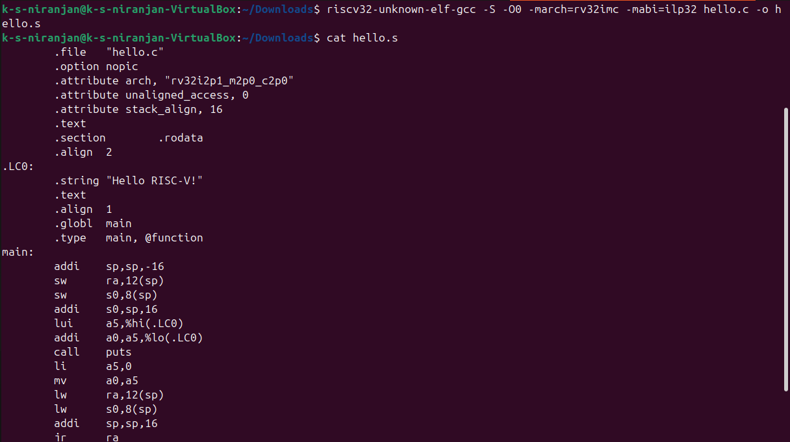

# From C to Assembly

## Step 1: Create a minimal Hello World program

```bash
nano hello.c
```

Paste the following code into it:

```c
#include <stdio.h>

int main() {
    printf("Hello RISC-V!\n");
    return 0;
}
```

---

## Step 2: Compile the C program to assembly (.s file)

```bash
riscv32-unknown-elf-gcc -S -O0 -march=rv32imc -mabi=ilp32 hello.c -o hello.s
```

---

## Step 3: View the generated assembly code

```bash
cat hello.s
```

---

## Sample output:

```asm
.file "hello.c"
.option nopic
.attribute arch, "rv32i2p1_m2p0_c2p0"
.attribute unaligned_access, 0
.attribute stack_align, 16
.text
.section .rodata
.align 2
.LC0:
    .string "Hello RISC-V!"
.text
.align 1
.globl main
.type main, @function
main:
    addi sp,sp,-16            # Prologue: allocate stack
    sw ra,12(sp)              # Save return address
    sw s0,8(sp)               # Save frame pointer
    addi s0,sp,16             # Set new frame pointer
    lui a5,%hi(.LC0)          # Load upper address of string
    addi a0,a5,%lo(.LC0)      # Load lower part into a0
    call puts                 # Call puts("Hello RISC-V!")
    li a5,0
    mv a0,a5                  # Return 0
    lw ra,12(sp)              # Restore return address
    lw s0,8(sp)               # Restore frame pointer
    addi sp,sp,16             # Free stack
    jr ra                     # Return
.size main, .-main
.ident "GCC: (g04696df096) 14.2.0"
.section .note.GNU-stack,"",@progbits
```

---

## Output Screenshot




