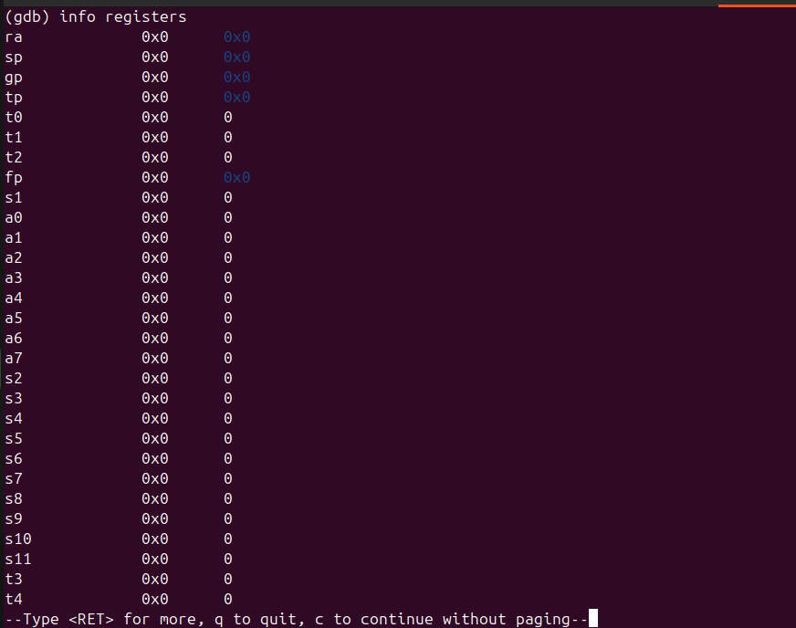
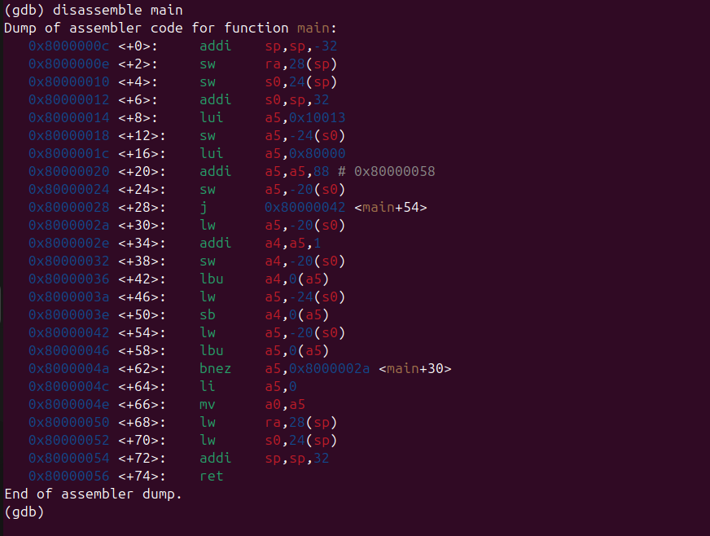

# Bare-Metal RISC-V Development on QEMU (SiFive E)

This document shows how to build, run, and debug a bare-metal RISC-V program on the QEMU SiFive E platform, printing to the UART console.

---

## Goal

Run a bare-metal RISC-V ELF program using an emulator (QEMU) and see output via UART console.

---

## Step 1: Compile your bare-metal program with debug symbols

Use this command to compile your `hello.c` with a linker script `link.ld` and debug info:

```bash
riscv32-unknown-elf-gcc -g -nostartfiles -nostdlib -T link.ld -o hello.elf hello.c start.s
```

- `-g` adds debug symbols for GDB.
- `-nostartfiles` and `-nostdlib` skip standard startup and library files (bare-metal).
- `-T link.ld` uses your custom linker script.

---

## Step 2: Run the ELF using QEMU

Launch QEMU with the SiFive E machine and no graphical output:

```bash
qemu-system-riscv32 -nographic -machine sifive_e -kernel hello.elf
```

- `-nographic` redirects UART output to your terminal.
- `-machine sifive_e` emulates the SiFive E310 board.

---

## Step 3: Debugging using GDB with QEMU

Start QEMU paused and waiting for GDB connection:

```bash
qemu-system-riscv32 -nographic -machine sifive_e -kernel hello.elf -S -gdb tcp::1234
```

- `-S` pauses CPU at start.
- `-gdb tcp::1234` opens GDB server on TCP port 1234.

In another terminal, run GDB:

```bash
riscv32-unknown-elf-gdb hello.elf
```

Connect to QEMU’s GDB server:

```gdb
(gdb) target remote :1234
```

---

### Useful GDB commands

- `info registers` — Show CPU register values.
- `disassemble main` — Disassemble the `main` function.
- `step` or `si` — Step through instructions.
- `continue` or `c` — Continue execution.
- `quit` — Exit GDB.

---

## Example: Disassemble output of `main`

```gdb
(gdb) disassemble main
Dump of assembler code for function main:
   0x8000000c <+0>:  addi    sp,sp,-32
   0x8000000e <+2>:  sw      ra,28(sp)
   0x80000010 <+4>:  sw      s0,24(sp)
   0x80000012 <+6>:  addi    s0,sp,32
   0x80000014 <+8>:  lui     a5,0x10013
   0x80000018 <+12>: sw      a5,-24(s0)
   0x8000001c <+16>: lui     a5,0x80000
   0x80000020 <+20>: addi    a5,a5,88 # 0x80000058
   0x80000024 <+24>: sw      a5,-20(s0)
   0x80000028 <+28>: j       0x80000042 <main+54>
   0x8000002a <+30>: lw      a5,-20(s0)
   0x8000002e <+34>: addi    a4,a5,1
   0x80000032 <+38>: sw      a4,-20(s0)
   0x80000036 <+42>: lbu     a4,0(a5)
   0x8000003a <+46>: lw      a5,-24(s0)
   0x8000003e <+50>: sb      a4,0(a5)
   0x80000042 <+54>: lw      a5,-20(s0)
   0x80000046 <+58>: lbu     a5,0(a5)
   0x8000004a <+62>: bnez    a5,0x8000002a <main+30>
   0x8000004c <+64>: li      a5,0
   0x8000004e <+66>: mv      a0,a5
   0x80000050 <+68>: lw      ra,28(sp)
   0x80000052 <+70>: lw      s0,24(sp)
   0x80000054 <+72>: addi    sp,sp,32
   0x80000056 <+74>: ret
End of assembler dump.
```

---

### Notes:

- Ensure your UART address in `hello.c` is `0x10013000` for SiFive E.
- The stack pointer (`sp`) is initialized in `start.s`.
- The linker script (`link.ld`) must place sections correctly for your hardware.

---

