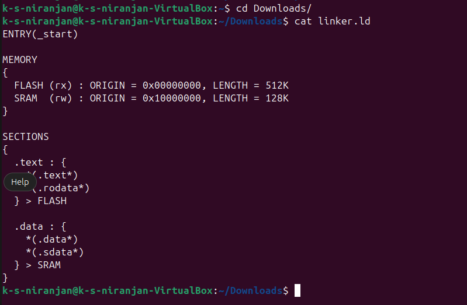

# Linker Script 101 for RV32IMC

## ✅ Minimal Linker Script (`link.ld`)

```ld
ENTRY(_start)

MEMORY
{
  FLASH (rx) : ORIGIN = 0x00000000, LENGTH = 512K
  SRAM  (rw) : ORIGIN = 0x10000000, LENGTH = 128K
}

SECTIONS
{
  .text : {
    *(.text*)
    *(.rodata*)
  } > FLASH

  .data : {
    *(.data*)
    *(.sdata*)
  } > SRAM
}
```

---

## 🧠 Explanation

### 🔹 Memory Regions

```ld
MEMORY {
  FLASH (rx) : ORIGIN = 0x00000000
  SRAM  (rw) : ORIGIN = 0x10000000
}
```

---
- **FLASH** (ROM) is where **executable code** (`.text`) is stored.
- **SRAM** is where **read/write data** (`.data`, `.bss`) is stored during runtime.

---

### 🔹 Section Mapping

```ld
.text : { *(.text*) *(.rodata*) } > FLASH
```

- All `.text` and `.rodata` sections (code and constants) go into FLASH starting at `0x00000000`.

```ld
.data : { *(.data*) *(.sdata*) } > SRAM
```

- All initialized data sections go into SRAM at `0x10000000`.

---

## 🔄 Why Flash vs SRAM?

| Region  | Address       | Purpose             | Access |
|---------|---------------|---------------------|--------|
| FLASH   | `0x00000000`  | Stores code         | Read/Execute (`rx`) |
| SRAM    | `0x10000000`  | Stores variables    | Read/Write (`rw`) |

- **FLASH** is non-volatile: used for program storage.
- **SRAM** is volatile: faster and used for dynamic data.

During boot:
- Code is executed **in place** from FLASH.
- `.data` (initialized variables) is copied to SRAM by startup code.
- `.bss` is zeroed in SRAM.
