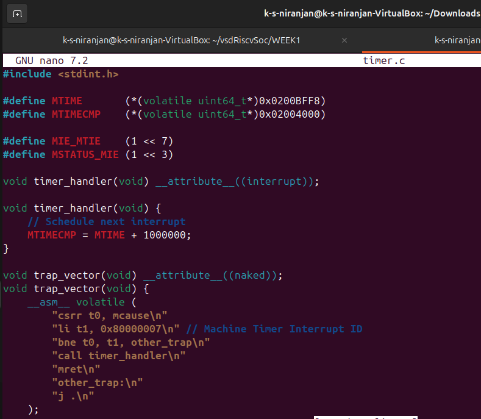

# Machine Timer Interrupt (MTIP) Setup in Bare-Metal RISC-V

This guide demonstrates how to enable and handle the **machine timer interrupt (MTIP)** in a bare-metal RISC-V environment.

---

## ✅ What This Program Does

1. Sets the timer interrupt using `mtimecmp`.
2. Enables `MTIP` in the `mie` register.
3. Enables global interrupts in the `mstatus` register.
4. Installs a custom trap handler using `mtvec`.
5. On timer interrupt, updates `mtimecmp` to trigger the next interrupt.

---

## 📁 Files

- `timer.c` – Main C file with MTIP setup and handler
- `linker.ld` – Linker script to place sections in RAM
- `crt0.s` – Startup assembly (provided separately)
---

## 🧠 Notes

- `mtime` and `mtimecmp` are memory-mapped registers. Address values used here work on QEMU and SiFive boards.
- Timer is set to trigger approximately every 1 million ticks (adjust as needed for your clock rate).

---
