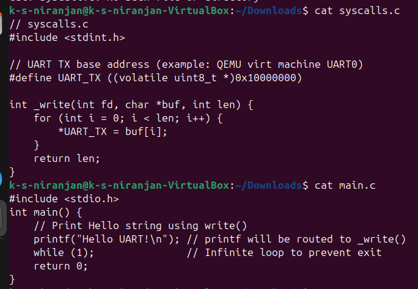
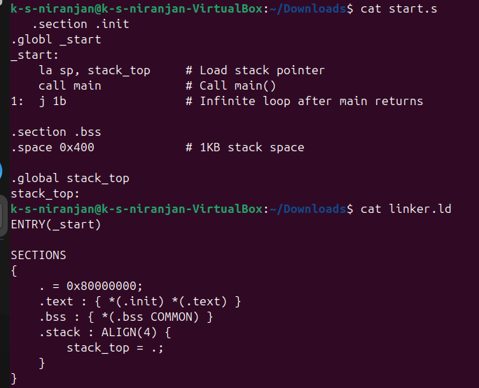
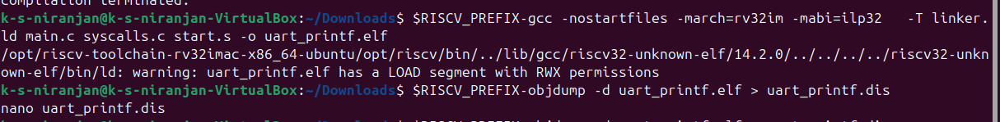

## 16 Using Newlib `printf` Without an OS

---

### **Question**  
**“How do I retarget `_write` so that `printf` sends bytes to my memory-mapped UART?”**

---

### **Answer Outline**  
- Implement `_write(int fd, char *buf, int len)` that loops over bytes to `UART_TX`.  
- Link with `-nostartfiles` + file `syscalls.c`.  
- Build with GCC and verify UART output.

---

### **Important Note on UART Address**  
When working on QEMU or actual RISC-V boards, the UART memory-mapped I/O address is `0x10000000`, not `0x80000000`. Using the wrong address will cause output to hang silently.

---

### 🛠️ Minimal `syscalls.c` Implementation
```c
// syscalls.c
#include <stdint.h>

// UART TX base address (example: QEMU virt machine UART0)
#define UART_TX ((volatile uint8_t *)0x10000000)

int _write(int fd, char *buf, int len) {
    for (int i = 0; i < len; i++) {
        *UART_TX = buf[i];
    }
    return len;
}
```

---

### 🧠 `main.c` File
```c
// main.c
int main() {
    // Print Hello string using write()
    printf("Hello UART!\n"); // printf will be routed to _write()
    while (1);               // Infinite loop to prevent exit
    return 0;
}
```

---

### ⚙️ `start.S` File
```asm
.section .init
.globl _start
_start:
    la sp, stack_top     # Load stack pointer
    call main            # Call main()
1:  j 1b                 # Infinite loop after main returns

.section .bss
.space 0x400             # 1KB stack space

.global stack_top
stack_top:
```

---

### 🧱 `linker.ld` File
```ld
ENTRY(_start)

SECTIONS
{
    . = 0x80000000;
    .text : { *(.init) *(.text) }
    .bss : { *(.bss COMMON) }
    .stack : ALIGN(4) {
        stack_top = .;
    }
}
```

---

### 🧪 Build & Debug
```sh
RISCV_PREFIX=riscv32-unknown-elf

$RISCV_PREFIX-gcc -nostartfiles -march=rv32im -mabi=ilp32 \
  -T linker.ld main.c syscalls.c start.S -o uart_printf.elf

$RISCV_PREFIX-objdump -d uart_printf.elf > uart_printf.dis

echo "Build done. Disassembly saved in uart_printf.dis"
```

---

### 💻 Terminal Commands
```sh
$ nano main.c
$ nano syscalls.c
$ nano start.S
$ nano linker.ld
$ nano build.sh
$ chmod +x build.sh
$ ./build.sh
$ nano uart_printf.dis
```

---

### 🧾 Disassembly Output (uart_printf.elf)

```text
uart_printf.elf:     file format elf32-littleriscv

Disassembly of section .text:

80000000 <_start>:
80000000:       00003117                auipc   sp,0x3
80000004:       cd410113                addi    sp,sp,-812 # 80002cd4 <stack_top>
80000008:       008000ef                jal     80000010 <main>
8000000c:       0000006f                j       8000000c <_start+0xc>

80000010 <main>:
80000010:       ff010113                addi    sp,sp,-16
80000014:       00112623                sw      ra,12(sp)
80000018:       00812423                sw      s0,8(sp)
8000001c:       01010413                addi    s0,sp,16
80000020:       800027b7                lui     a5,0x80002
80000024:       20c78513                addi    a0,a5,524 # 8000220c <__errno+0xa>
80000028:       19a000ef                jal     800001c2 <puts>
8000002c:       0000006f                j       8000002c <main+0x1c>

80000030 <_write>:
80000030:       fd010113                addi    sp,sp,-48
80000034:       02112623                sw      ra,44(sp)
80000038:       02812423                sw      s0,40(sp)
8000003c:       03010413                addi    s0,sp,48
80000040:       fca42e23                sw      a0,-36(s0)
```

---
