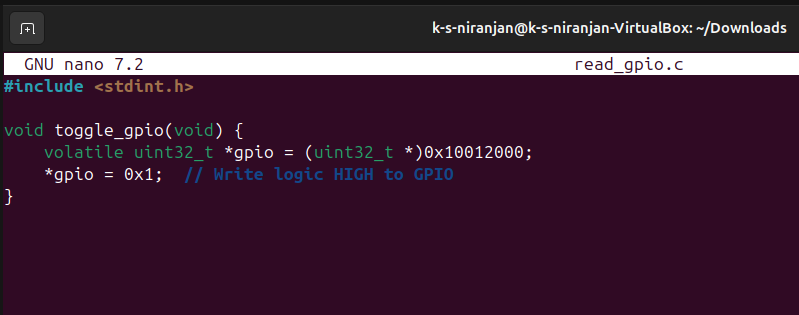

# Bare-metal GPIO Toggle with Volatile and Alignment Explanation

## ✅ C Snippet: Toggle GPIO Register

```c
#include <stdint.h>

void toggle_gpio(void) {
    volatile uint32_t *gpio = (uint32_t *)0x10012000;
    *gpio = 0x1;  // Write logic HIGH to GPIO
}
```

---
