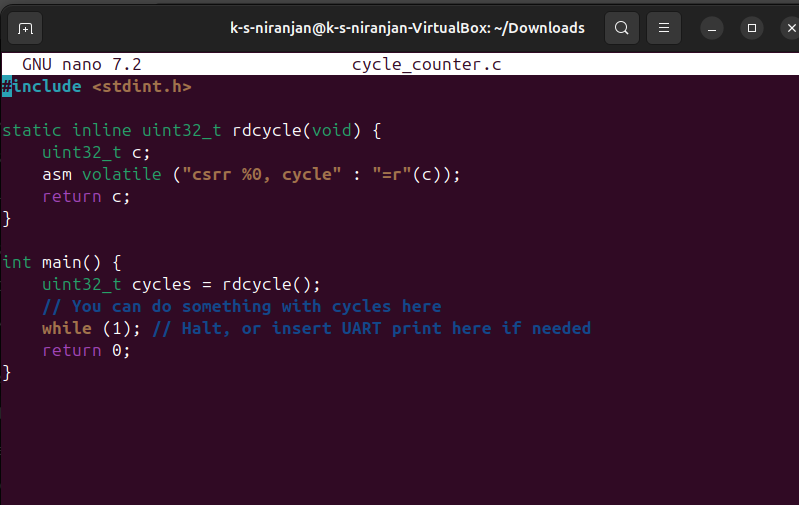

# Reading RISC-V Cycle Counter Using Inline Assembly

## ✅ C Function

```c
#include <stdint.h>

static inline uint32_t rdcycle(void) {
    uint32_t c;
    asm volatile ("csrr %0, cycle" : "=r"(c));
    return c;
}
```

---

## 🧠 Explanation of Constraints

### 🔹 `asm volatile (...)`

- **`asm`**: Invokes an inline assembly block.
- **`volatile`**: Tells the compiler **not to optimize away** this assembly statement.
  - Important for reading hardware registers like `cycle`, which change constantly.

---

### 🔹 `"csrr %0, cycle"`

- **`csrr`**: RISC-V instruction to read from a Control and Status Register (CSR).
- **`cycle`**: A pseudo-name for CSR address `0xC00`, holding the current cycle count.
- **`%0`**: Refers to the **first output operand** listed after the colon (`:`). The compiler substitutes this with a register.

---

### 🔹 `: "=r"(c)`

This tells the compiler how to treat the operand.

#### ✅ `=r`
- **`=`**: Output-only operand.
- **`r`**: Operand is placed in a **general-purpose register**.

#### ✅ `(c)`
- Binds the operand to the **C variable `c`**.
- The result of `csrr` goes into variable `c`.

---

## 🔚 Summary

| Syntax Part          | Meaning |
|----------------------|---------|
| `asm volatile`       | Inline assembly that must not be optimized away |
| `"csrr %0, cycle"`   | Read from cycle CSR into operand 0 (register) |
| `=r`                 | Output-only, placed in a general-purpose register |
| `(c)`                | Result goes into C variable `c` |
