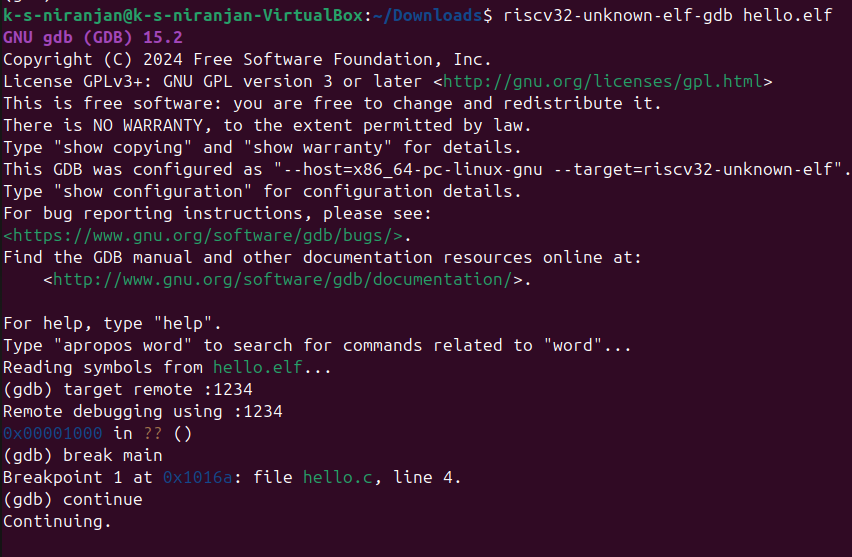

## 1. Requirements

- `riscv32-unknown-elf-gdb` installed
- Compiled RISC-V ELF binary (e.g., `hello.elf`)
- A simulator like QEMU running with GDB support (listening on port `1234`)

---

## 2. Start GDB with the ELF File

Open your terminal and run:

```bash
riscv32-unknown-elf-gdb hello.elf
```

This launches the debugger and loads your ELF file.

---

## 3. Connect to the Simulator

Make sure your simulator is running and listening on port `1234`, then connect GDB to it:

```gdb
(gdb) target remote :1234
```

Example output:

```
Remote debugging using :1234
0x00001000 in ?? ()
```

This confirms that GDB is connected to the target.

---

## 4. Set a Breakpoint at `main`

Now set a breakpoint at the beginning of the `main` function:

```gdb
(gdb) break main
```

Example response:

```
Breakpoint 1 at 0x1016a: file hello.c, line 4.
```

This means the debugger will pause execution when `main` is reached.

---

## 5. Continue Execution

Start or resume execution with:

```gdb
(gdb) continue
```

This runs the program until it hits the breakpoint or another stopping condition.

---

## 7. Inspect Registers

To check the value of a specific register, like `a0`, use:

```gdb
(gdb) info registers a0
```

Sample output:

```
a0             0x0    0
```

You can also use `info registers` to list all registers.

---

## 8. Disassemble (Optional)

To view the assembly instructions around the current location:

```gdb
(gdb) disassemble
```

This shows the instructions in memory at the current program counter, useful for low-level debugging.

---

## 9. Example Screenshots

### Breakpoint Set at `main`


### Continue Execution Output



### Register Inspection (`a0`)


---

## 10. Notes

- Use `Ctrl+C` in GDB to interrupt execution at any time.
- For a visual terminal interface, try:
  - `layout asm` — Show assembly view
  - `layout src` — Show source code view
- If `main` is not hit, ensure your program is not exiting before reaching it or crashing early.
