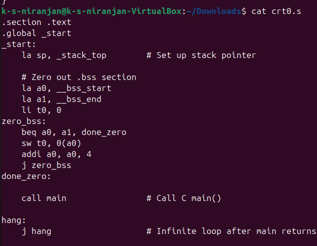

# Bare-Metal RISC-V Startup Code: `crt0.S`

This document provides a basic explanation and example of `crt0.S` used in bare-metal RISC-V programming.

## 🔍 What `crt0.S` Does

- Sets the **stack pointer**
- Zeroes out the **.bss** section
- Optionally copies **.data** section from ROM to RAM
- Calls the **main()** function written in C
- Falls into an **infinite loop** if `main()` returns

## 📄 Example: Minimal `crt0.S`

```asm
.section .text
.global _start
_start:
    la sp, _stack_top        # Set up stack pointer

    # Zero out .bss
    la a0, __bss_start
    la a1, __bss_end
zero_bss:
    beq a0, a1, done_zero
    sw zero, 0(a0)
    addi a0, a0, 4
    j zero_bss
done_zero:

    call main                # Call the main function

hang:
    j hang                   # Infinite loop
```

---

## 📦 Where to Get `crt0.S`

- **Newlib source**: https://github.com/bminor/newlib
- **SiFive SDK**: https://github.com/sifive/freedom-e-sdk
- Or write your own minimal version as above.

## 📁 Files Included

- `crt0.s` - Startup Assembly File
